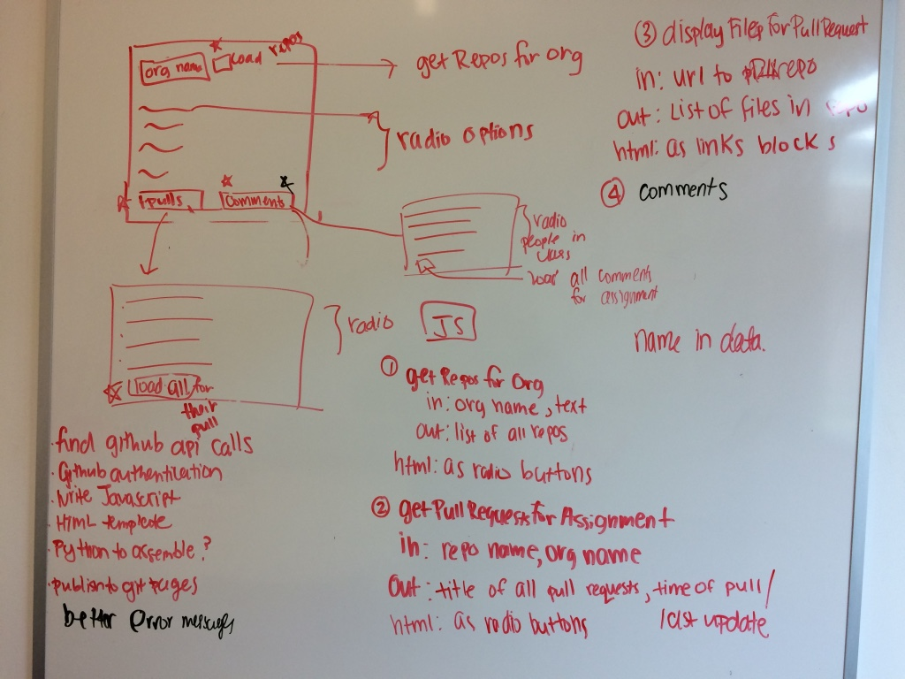

## Currently

- Trying to figure out how to dynamically set the radio button value, may need to switch to a different display technique?: $('[name="foo"]').val(2);

## State of the code
- Helps user find or generate a new api token to auth 
- You can enter in the username, organization, and auth token to generate list of repos
- Can pick github repo, will show you all pull requests
- need to find a way to save student user name so that I can generate the file -- right now we are tracking the last pull request
- everything live insides the `index.html` file and maybe I should have a separate javascript, and html file 
- 

## Tasks

- Refactor the code to separate JS and index files, scrap leftovers not in repo 
- ~~Figure out the necessary github api calls~~
- - ~~Publish on github pages~~
- ~~github authentication~~
	- https://developer.github.com/guides/getting-started/
	- https://github.com/prose/gatekeeper
- write Javascript / HTML for each of the three components in reference
- Template out the HTML and Javscript parts, maybe using Python to asseble
- Documentation
- Another iteration for the logic involved in getting the comments involved in the 
- compile mini reference for github api calls 

## Control flow working concept

## Github api calls reference 
All repos in a given organization
https://api.github.com/orgs/hmc-cs111-fall2015/repos

Pull Requests for a given repo
https://api.github.com/repos/hmc-cs111-fall2015/what-is-a-DSL/pulls/10

For the last time the pull request was updated at 
updated_at

Comments on a given pull request
https://api.github.com/repos/hmc-cs111-fall2015/what-is-a-DSL/pulls/9/comments

For who made this comment
user

For where the comment sits contextually
diff_hunk

For what the comment is 
body

For where the comment is on the web
url
